## _215611104 - Elsa Setiyawati_

# Latihan

## 1. Instalasi GIT di Windows

Sebelum install maka download terlebih dahulu file master Git.

1. Setelah itu, jalankan file master tersebut dengan cara klik double filenya. Maka akan muncul gambar di bawah ini lisensi git. Klik **Next** .

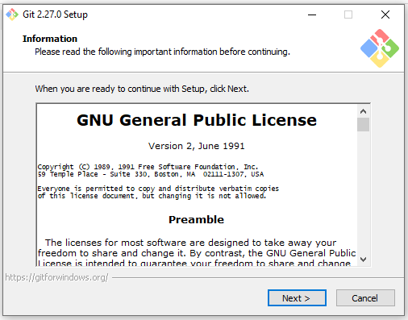

2. Kemudian, pilih lokasi instalasi. Secara default akan terisi C:\Program Files\Git. Ganti lokasi jika memang anda menginginkan lokasi lain. Klik **Next** .

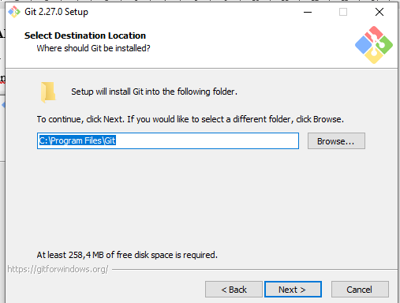

3. Klik **Next** pada pilih komponen, karena pengaturan sudah default.

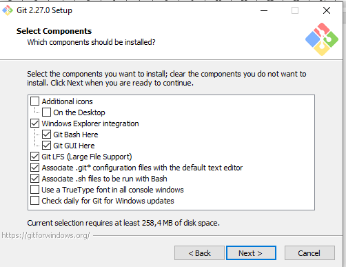

4. Setting nama shortcut, klik **Next** untuk melanjutkan atau ganti nama sesuai keinginan.

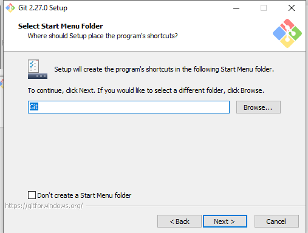

5. Pilih editor untukk Git. Klik **Next**.

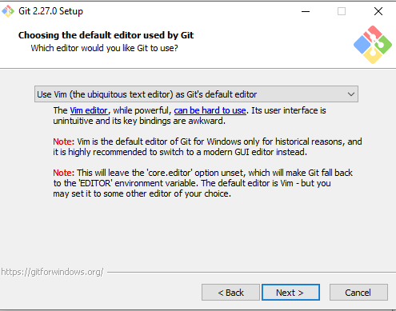

6. Menambahkan path environment untuk Git, klik **Next**.

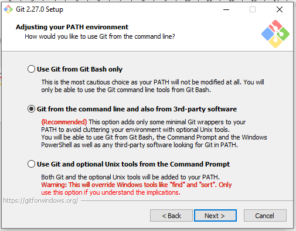

7. Setting HTTPS yang akan digunakan, klik **Next**.

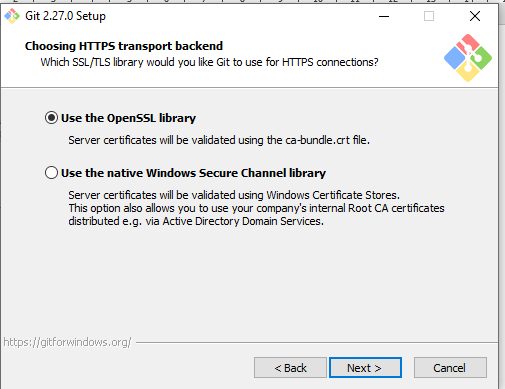

8. Setting pengaturan text pada editor untuk Git. Klik **Next**.

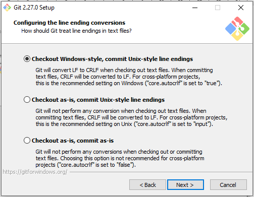

9. Setting konfigurasi terminal emulator dengan menggunakan Git Bash. klik **Next** .


10. Memilih default untuk git pull. klik **Next**.

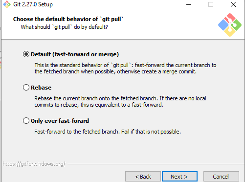

11. Konfigurasi fitur untuk dienable. klik **Next**.

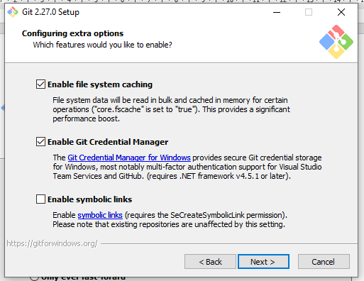

12. Lalu, klik Install

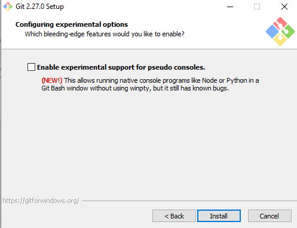

13. Proses instalasi berjalan, tunggu hingga selesai.

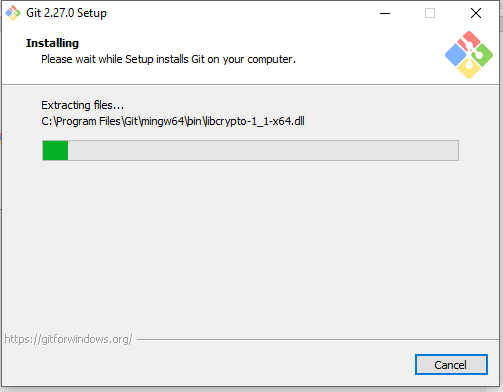

14. Proses instalasi telah selesai, pilih yes jika ingin restart komputer sekarang, atau pilih no jika belum akan merestart komputer. klik **Next**

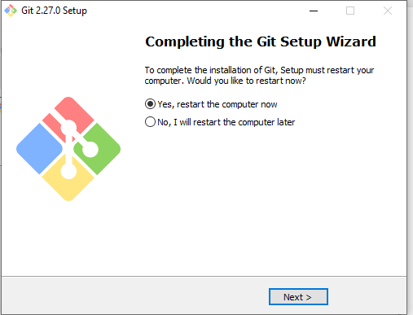

15. Mengecek apakah git sudah terinstall dan mengetahui versinya. dengan perintah "git --version".

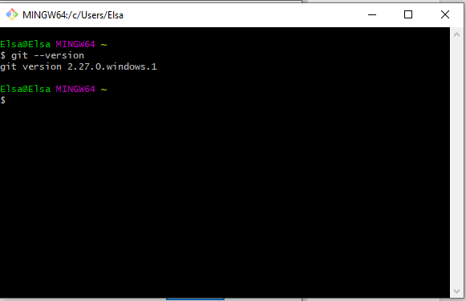

## 2. Konfigurasi GIT

konfigurasi git dilakukan dengan perintah berikut ini :

1. Berikan perintah berikut, dengan nama serta email yang digunakan untuk mendaftar di GitHub.

```sh
$ git config --global user.name "Nama Anda di GitHub"
$ git config --global user.email email@domain.tld
```

2. untuk melihat hasil konfigurasi dengan perintah

```sh
$ git config --list
```

untuk hasilnya seperti ini

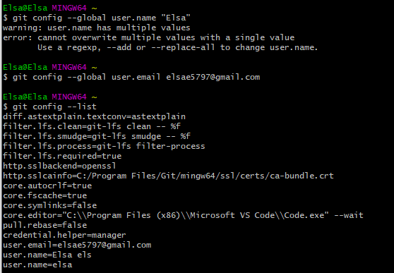

## 3. Mengelola Repo Sendiri di Account Sendiri

Berikut ini langkah - langkah untuk membuat repository sendiri:

1. Klik tanda + pada bagian atas setelah login, pilih **New repository**


2. Isikan nama, lalu memilih mau public atua prive repo yang akan dibuat. klik **Create repository**.

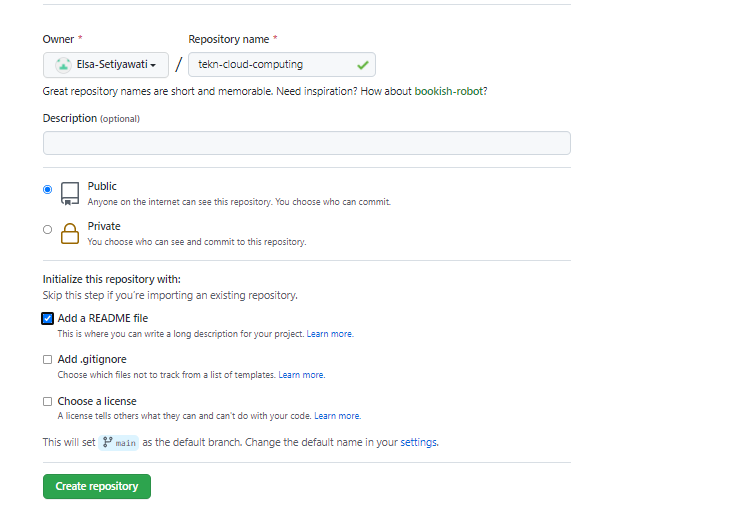

3. Hasil repository yang telah dibuat.

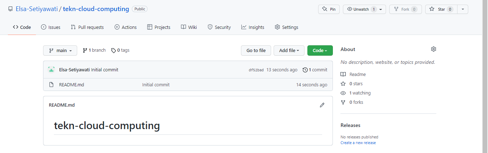

## 3. Mengelola Repo Sendiri di Organisasi

Untuk membuat repository organisasi, masuk pada Organisasi Kalian lalu Klik tanda + pada bagian atas setelah login, pilih **New repository** , lalu memilih mau public atua prive repo yang akan dibuat. klik **Create repository**. lalu, hasilnya seperti gambar berikut ini.

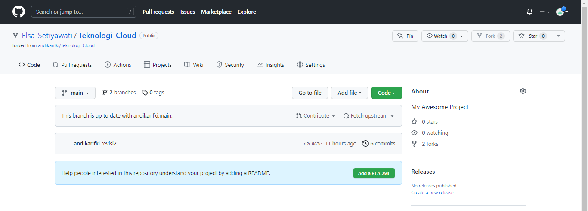
