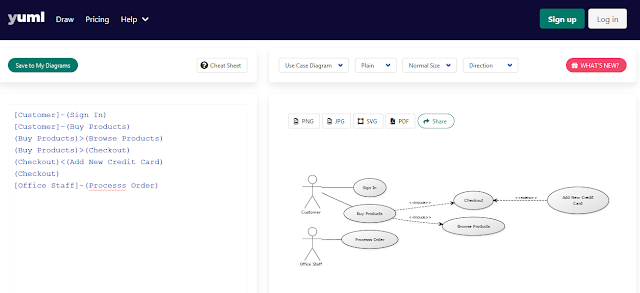
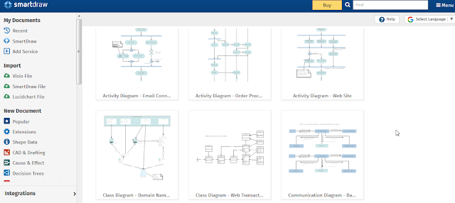
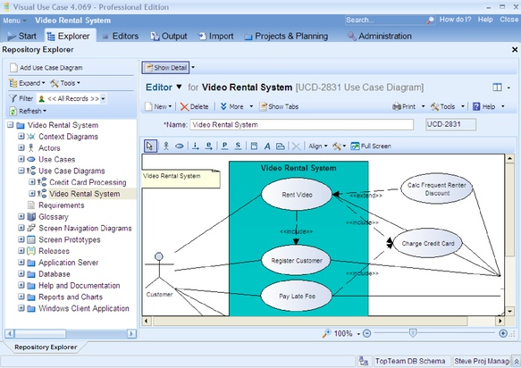
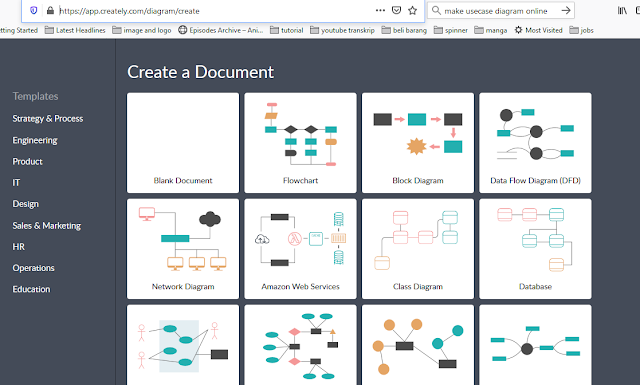

## _215611104 - Elsa Setiyawati_

# Software untuk membuat diagram yaitu :

## Software untuk membuat diagram Cloud :

### 1. Yuml.me

Aplikasi untuk membuat class diagram adalah yuml.me yang bisa di akses di https://yuml.me/diagram/usecase/draw . Membuat usecase dengan cara mengetikkannya di sebelah kiri layar dan nanti perintah yang di ketik akan tampil di layar sebelah kanan.

### 2. Smartdraw

Aplikasi yang bisa digunakan untuk menggambar UML diagram adalah smartdraw yang dapat diakses di alamat https://cloud.smartdraw.com.

## Software untuk membuat diagram versi non-cloud :

### 1. Visual Use Case

Aplikasi untuk membuat diagram dengan versi desktop.

### 2. Creately

Untuk tampilan yang simple namun bisa menjelaskan berbagai alur program yang ingin dijabarkan. Aplikasi web creately bisa menjadi pilihannya.

