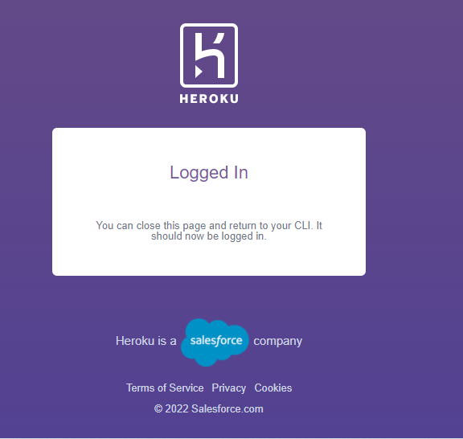
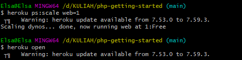

## _215611104 - Elsa Setiyawati_

# PEMBAHASAN

## LATIHAN

Heroku adalah platform cloud sebagai layanan (PaaS) yang mendukung beberapa bahasa pemrograman. Salah satu platform cloud pertama, Heroku telah dikembangkan sejak Juni 2007, ketika hanya mendukung bahasa pemrograman Ruby, tetapi sekarang mendukung Java, Node.js , Scala , Clojure , Python , PHP , dan Go. Untuk alasan ini, Heroku dikatakan sebagai platform poliglot karena memiliki fitur untuk pengembanguntuk membangun, menjalankan, dan menskalakan aplikasi dengan cara yang sama di sebagian besar bahasa. Heroku diakuisisi oleh Salesforce pada 2010.

### 1. Signup ke Heroku

Berikut ini Langkah-langkah signup ke Heroku :

1. Signup ke Heroku, melalui url = https://signup.heroku.com/ , isi form yang dibutuhkan seperti gambar dibawah ini, lalu klik create free account.

2. Selanjutnya muncul tampilan berikut untuk melakukan pengecekan email guna verifikasi.
   

3. Berikut ini tampilan di email , klik link pada email tersebut.
   

4. Setelah masuk ke link tersebut, berikut ini tampilannya, yaitu untuk setting password Heroku, klik set password and log in untuk melanjutkan login ke Heroku.
   

5. Kemudian, berikut ini tampilan berhasil Signup ke Heroku.
   

### 4. Getting Started on Heroku with Python

1. Download Heroku CLI, sesuaikan dengan sistem operasi masing-masing.
   

2. Install hasil download Heroku CLI tadi, berikut ini proses download Heroku, tungu hingga proses instalasi selesai.
   

3. Mulai untuk login Heroku CLI, pada command prompt ketikkan “heroku login”. Lalu akan diarahkan untuk ke browser.
   

4. Berikut ini tampilan untuk halaman login Heroku di browser, klik “Log In” untuk dapat login ke Heroku CLI.
   

5. Setelah itu, muncul tampilan di bawah ini berati Heroku CLI sudah berhasil login.
   

6. Kemudian, pada command prompt tadi akan muncul tampilan verifikasi bahwa sudah berhasil login.
   

7. Selanjutnya yaitu create new app untuk clone aplikasi python.
   

8. Masuk ke directori project tersebut, lalu berikan perintah “create Heroku” untuk mendapatkan domain. domain tersebut alamat untuk membuka aplikasi yang telah dibuat.
   

9. Selanjutnya push project Heroku ke python, dengan perintah = “git push heroku main”, tunggu hingga proses selesai.
   

10. Kemudian, berikan perintah “heroku open” untuk membuka hasil aplikasi python menggunakan Heroku, seperti gambar di bawah ini berati aplikasi python di Heroku berhasil.
    

## TUGAS

Membuat deployement ke PaaS di Heroku untuk PHP, berikut ini langkah-langkahnya :

1. Buka new terminal, lalu clone aplikasi php.
   

2. Kemudian, masuk ke folder aplikasi php.
   

3. Selanjutnya, buat Heroku baru dengan perintah “heroku create” untuk mendapatkan link domain.
   

4. Push Heroku ke php, dengan perintah = “git push heroku main”, tunggu hingga proses selesai.
   

5. Jalankan “heroku open” untuk membuka aplikasi php di Heroku yang telah dibuat.
   

6. Berikut ini tampilan hasil aplikasi php yang dibuat menggunakan Heroku.
   
