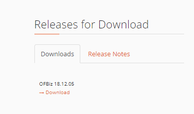
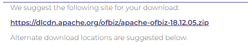
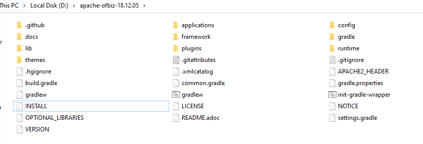
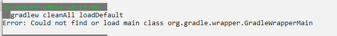
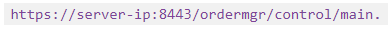

## _215611104 - Elsa Setiyawati_

# PEMBAHASAN

## LATIHAN

### 1. BPAAS

Proses Bisnis sebagai Layanan (BPaaS) adalah setiap jenis proses bisnis horizontal atau vertikal yang disampaikan berdasarkan model layanan awan. Layanan awan ini - yang meliputi Software sebagai Service (SaaS), Platform sebagai Layanan (PaaS), dan Infrastructure as a Service (IaaS) - karena itu tergantung pada layanan terkait.

### 2. Apache OFBiz

Apache OFBiz adalah sistem perencanaan sumber daya perusahaan yang menyediakan seperangkat aplikasi perusahaan yang mengintegrasikan dan mengotomatisasi banyak proses bisnis suatu perusahaan. OFBiz adalah proyek tingkat atas Apache Software Foundation.

### 3. Install dan menjalankan Apache OFBiz

1. Download file JDK apache obiz

2. Berikut ini link file masternya

3. Setelah berhasil di download, ekstrak file zip tersebut. lalu berikut ini isi dari file master tersebut

4. Buka terminal, arahkan pada lokasi dimana folder Apache Ofbiz berada. Berikan perintah untuk windows = gradlew cleanAll loadDefault

5. Jika muncul proses, tunggu sampai proses tersebut selesai.
6. Untuk pengecekan ketikkan perintah =
   
