## _215611104 - Elsa Setiyawati_

# 1. Install Go, MySQL, dan MongoDB

## 1) Install Go

Berikut ini Langkah untuk install Go :
1.1) Pertama, Download Go sesuai OS yang digunakan
1.2) Install Go, ikuti saja seperti install aplikasi pada umunya.
1.3) Setelah selesai install, cek Go di terminal
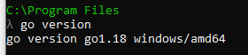

## 2) Install MySQL

Berikut ini Langkah untuk install MySQL:
1.1) Pertama, Download MYSQL sesuai OS yang digunakan
1.2) Install MySQL, ikuti saja seperti install aplikasi pada umunya.
1.3) Setelah selesai install, cek MySQL di terminal
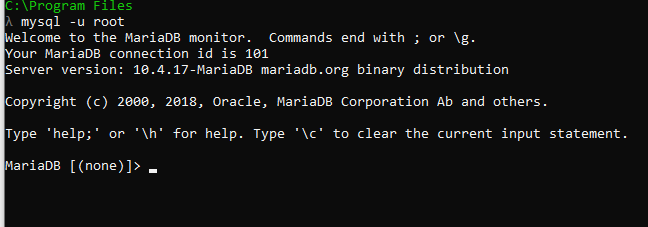

## 3) Install MongoDB

Berikut ini Langkah untuk install MongoDB:
1.1) Pertama, Download MONGODB sesuai OS yang digunakan
1.2) Install MongoDB, ikuti saja seperti install aplikasi pada umunya.
1.3) Setelah selesai install, cek MongoDB di terminal
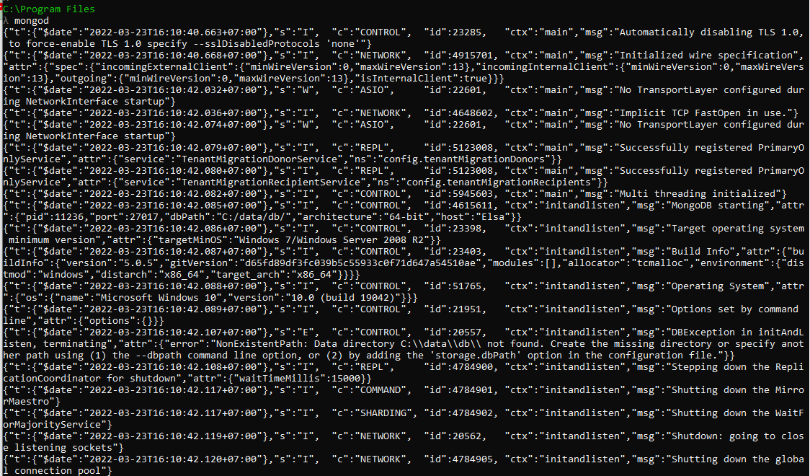

# 2. Buat 2 contoh program Go masing-masing untuk koneksi dan membaca data dari MySQL dan MongoDB.

## 1) Koneksi Go dengan MySQL untuk membaca data

Berikut ini Langkah-langkah nya :
1.1) Pertama yaitu, membuat Module Go dengan perintah "go mod init example/latihan"
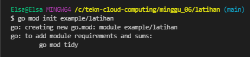
1.2) Lalu, install library driver Mysql "go get github.com/go-sql-driver/mysql"
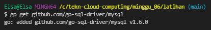
1.3) Membuat file MySQL.go, agar MySQL bisa terkoneksi dengan Go. Berikut ini kode program di file MySQL.go
package main
import (
"database/sql"
"fmt"

    _ "github.com/go-sql-driver/mysql"

)

type propinsi struct {
id int
propinsi string
}
func (p propinsi) String() string {
return fmt.Sprintf("%d, %s", p.id, p.propinsi)
}
func main() {
db, err := sql.Open("mysql",
"root@tcp(127.0.0.1:3306)/laravel")
if err != nil {
fmt.Println(err)
} else {
fmt.Println("Connected")
// var id = 1
rows, err := db.Query("select id, propinsi from propinsi ")
if err != nil {
fmt.Println(err.Error())
return
}
defer rows.Close()

    	var result []propinsi

    	for rows.Next() {
    		var each = propinsi{}
    		var err = rows.Scan(&each.id, &each.propinsi)

    		if err != nil {
    			fmt.Println(err.Error())
    			return
    		}

    		result = append(result, each)
    	}

    	if err = rows.Err(); err != nil {
    		fmt.Println(err.Error())
    		return
    	}

    	for _, each := range result {
    		fmt.Println(each.String())
    	}
    }
    defer db.Close()

}

1.4) Kemudian, menjalankan program dengan perintah "go run MySQL.go". jika berhasil terkoneksi maka akan muncul pesan “Connected” seperti gambar berikut ini.
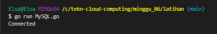

## 2) Koneksi Go dengan MongoDB untuk membaca data

Berikut ini Langkah-langkah nya :
1.1) Pertama, membuat Module Go dengan "go mod init example/latihan"

1.2) Lalu, install library driver MongoDB "go get go.mongodb.org/mongo-driver/mongo"
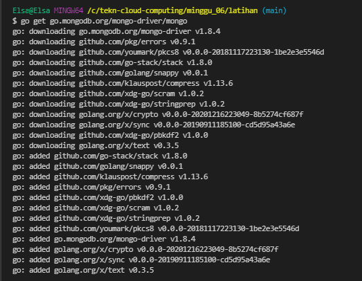
1.3) Membuat file MongoDB.go, agar bisa terkoneksi dengan Go. Berikut ini kode program di file MongoDB.go

package main

import (
"context"
"log"

    "go.mongodb.org/mongo-driver/bson"
    "go.mongodb.org/mongo-driver/mongo"
    "go.mongodb.org/mongo-driver/mongo/options"
    "go.mongodb.org/mongo-driver/mongo/readpref"

)

type Users struct {
Name string `json:"name"`
Email string `json:"email"`
}

func GetClient() \*mongo.Client {
clientOptions := options.Client().ApplyURI("mongodb://localhost:27017")
client, err := mongo.NewClient(clientOptions)
if err != nil {
log.Fatal(err)
}
err = client.Connect(context.Background())
if err != nil {
log.Fatal(err)
}
return client
}

func ReturnAllUsers(client *mongo.Client, filter bson.M) []*Users {
var users []\*Users
collection := client.Database("coba").Collection("users")
cur, err := collection.Find(context.TODO(), filter)
if err != nil {
log.Fatal("Error on Finding all the documents", err)
}
for cur.Next(context.TODO()) {
var item Users
err = cur.Decode(&item)
if err != nil {
log.Fatal("Error on Decoding the document", err)
}
users = append(users, &item)
}
return users
}

func main() {
c := GetClient()
err := c.Ping(context.Background(), readpref.Primary())
if err != nil {
log.Fatal("Couldn't connect to the database", err)
} else {
log.Println("Connected!")
}

    users := ReturnAllUsers(c, bson.M{})
    for _, item := range users {
    	log.Println(item.Name, item.Email)
    }

}

1.4) Kemudian, menjalankan program dengan perintah "go run MongoDB.go". jika berhasil terkoneksi maka akan muncul pesan “Connected” seperti gambar berikut ini.
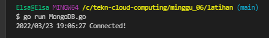

## 3) Dengan menggunakan Gin, buatlah RESTful API untuk membaca data dari MySQL dan MongoDB tersebut.

### 1. RESTful API untuk membaca data MySQL menggunakan Gin

Berikut ini Langkah-langkahnya :
1.1) Create Module Go dengan "go mod init example/gin-mysql"
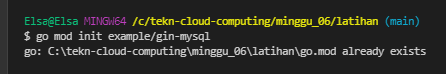
1.2) Kemudian, install framework gin "go get -u github.com/gin-gonic/gin"
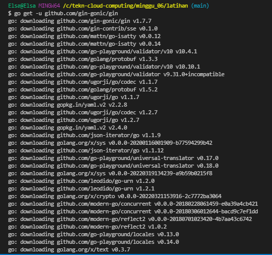
1.3) lalu, install library driver Mysql "go get github.com/jinzhu/gorm/dialects/mysql"
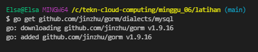
1.4) install library pendukung "go get github.com/jinzhu/gorm"
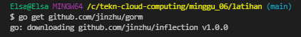
1.5) Membuat file main.go, untuk mengubungkan framework Gin dengan MySQL

package main
import (
"net/http"
"github.com/gin-gonic/gin"
"github.com/jinzhu/gorm"
\_ "github.com/jinzhu/gorm/dialects/mysql"
)

var db \*gorm.DB

func init() {
var err error
db, err =
gorm.Open("mysql", "root@tcp(127.0.0.1:3306)/laravel")
if err != nil {
panic("Gagal Conect Ke Database")
}
}

type (
propinsi struct {
ID int `json:"id"`
Propinsi string `json:"propinsi"`
}
)

func fetchAllPropinsi(c \*gin.Context) {
var model []propinsi

    db.Find(&model)

    if len(model) <= 0 {
    	c.JSON(http.StatusNotFound, gin.H{"message": http.StatusNotFound, "result": "Data Tidak Ada"})
    }

    c.JSON(http.StatusOK, gin.H{"message": http.StatusOK, "result": model})

}

func main() {

    router := gin.Default()
    v1 := router.Group("/api/propinsi")
    {
    	v1.GET("", fetchAllPropinsi)
    }
    router.Run(":20001")

}

1.6) Selanjutnya, jalankan main.go "go run main.go"
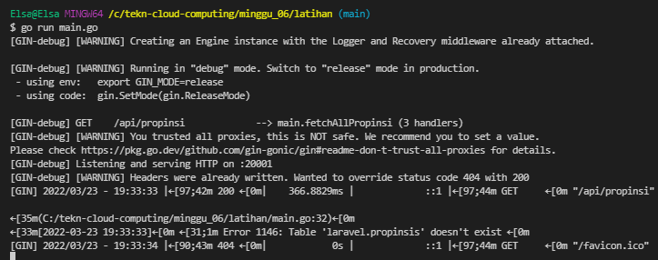
1.7) Selanjutnya, cek di browser akses http://localhost:20001/api/propinsi
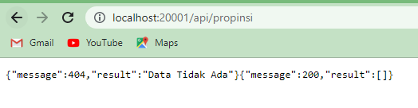

### 2. RESTful API untuk membaca data MongoDB menggunakan Gin

Berikut ini Langkah-langkahnya :
1.1) Pertama, membuat Module Go dengan "go mod init example/gin-mongodb"
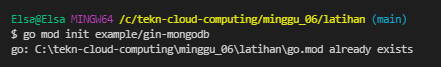
1.2) Selanjutnya, install framework gin "go get -u github.com/gin-gonic/gin"
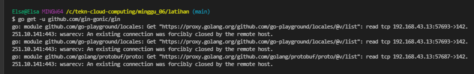
1.3) install library driver MongoDB "go get go.mongodb.org/mongo-driver/mongo”
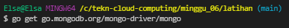
