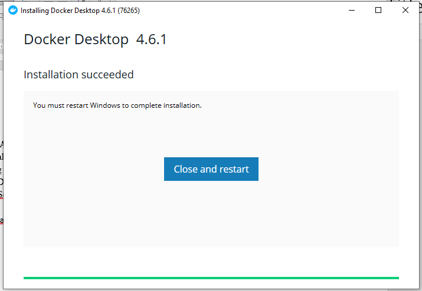
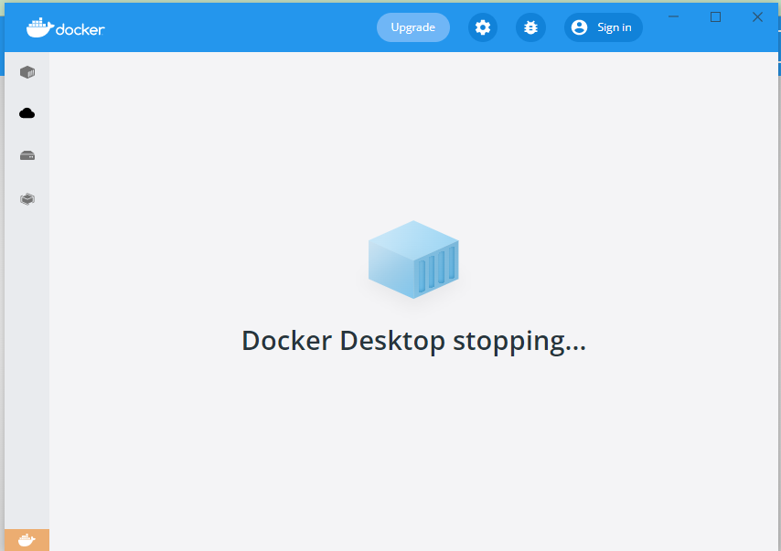
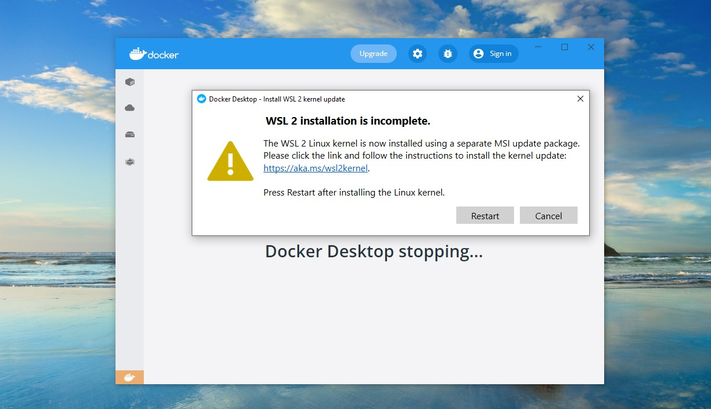
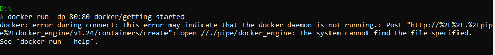

## _215611104 - Elsa Setiyawati_

# 1. Install Docker sesuai petunjuk pada Materi dan Pembahasan di atas, sesuaikan dengan OS yang anda gunakan.

## 1) Download file master aplikasi Docker, pilih sesuai OS yang digunakan..

## 2) Setelah download, double klik file tersebut untuk menginstall.

## 3) Berikut ini akhir dari proses install Docker.

## 4) kemudian, buka aplikasi Docker Dekstop, maka hasil tampilannya seperti ini, dan Docker Desktop siap digunakan.

# 2. Get Started - Docker

