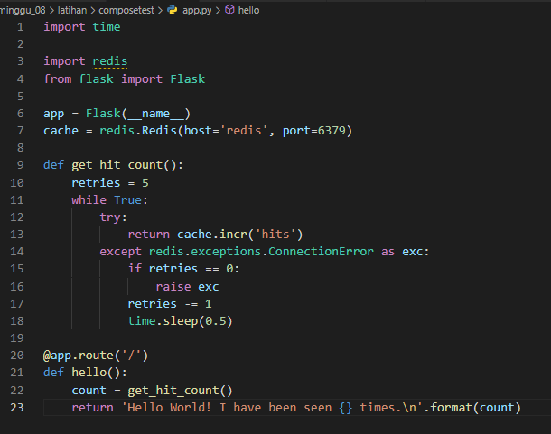
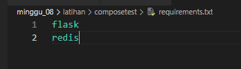
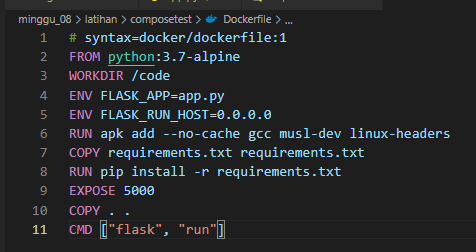
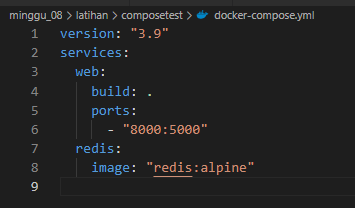
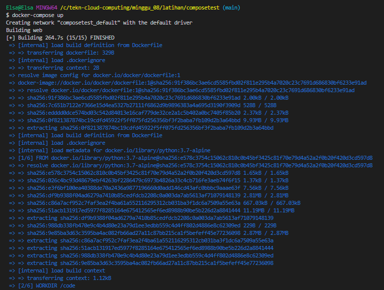
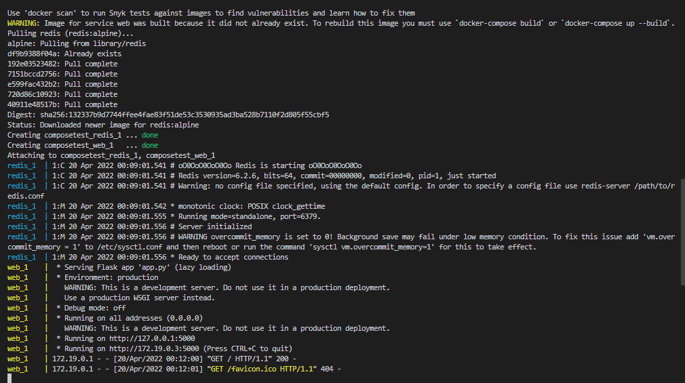
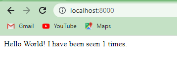
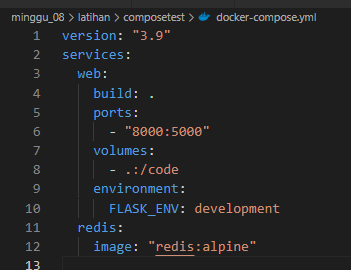
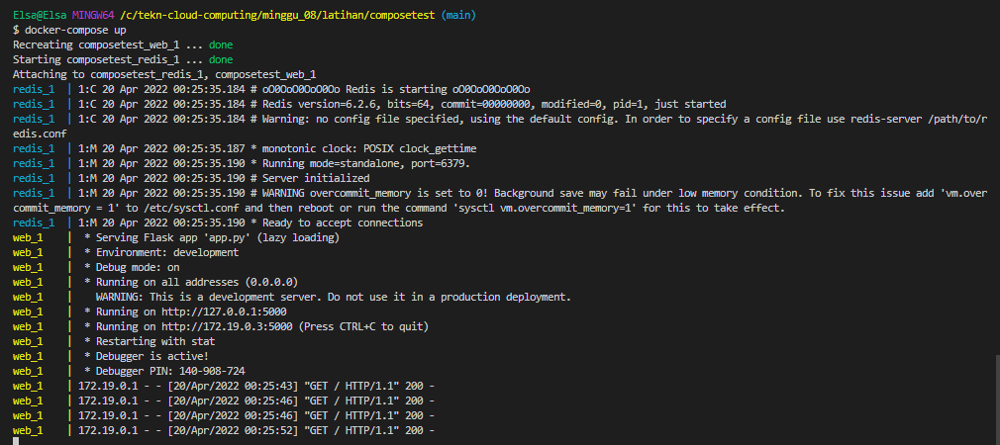
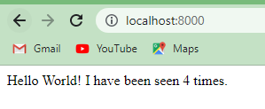

## _215611104 - Elsa Setiyawati_

# LATIHAN

## Getting Started - Docker Compose :

### 1. Langkah pertama yaitu mmebuat folder yang digunakan untuk getting started – docker compose, diberi nama folder composetest.

### 2. Kemudian, membuat file app.py didalam folder composetest. Berikut ini kode programnya.

### 3. Membuat file requirements.txt di dalam folder composetest. Berikut ini kode programnya.

### 4. Membuat file Dockerfile di dalam folder composetest. Berikut ini kode programnya.

### 5. Membuat file docker-compose.yml di dalam folder composetest. Berikut ini kode programnya.

### 6. Selanjutnya melakukan pengetesan, berikan perintah pada docker compose dengan perintah "docker-compose up".

### 7. Jalankan localhost:8000 pada browser. berikut ini hasilnya. Berarti getting started with docker compose sudah berhasil.

### 8. Lalu, ubah file docker-compose.yml di dalam folder composetest, dengan kode program berikut ini.

### 9. Setelah itu, jalankan perintah "docker-compose up".

### 10. Berikut ini hasilnya di browser, dengan perintah localhost:8000.

