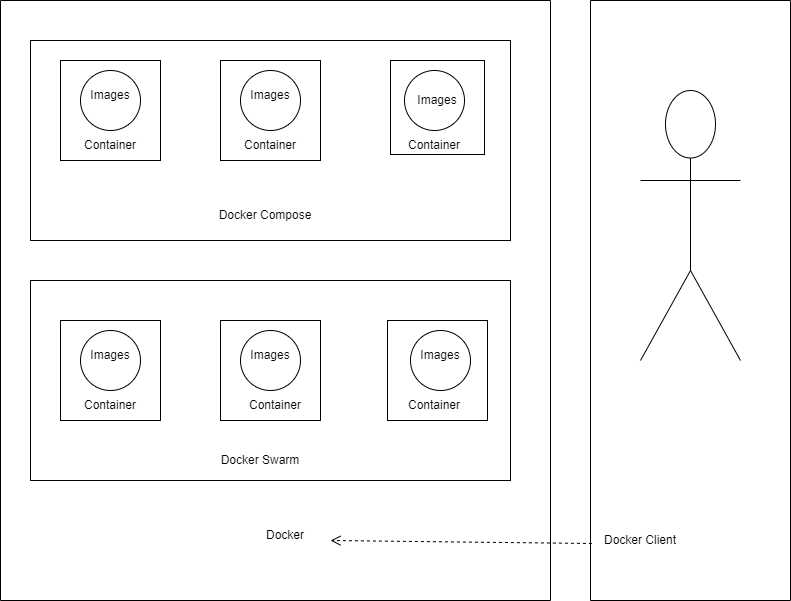

## _215611104 - Elsa Setiyawati_

# TUGAS

## DIAGRAM

### Penjelasan =

#### 1. Docker images merupakan isi dan dijalankan di docker container

#### 2. Docker compose dan docker swarm merupakan container manajemen dari Docker.

#### 3. Untuk mengakses docker menggunakan docker client biasane menggunakan cli atau docker dekstop untuk windows
