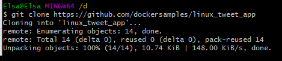
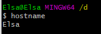
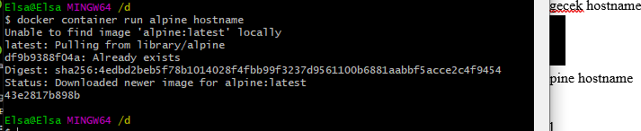
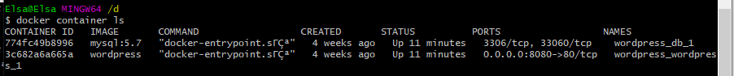
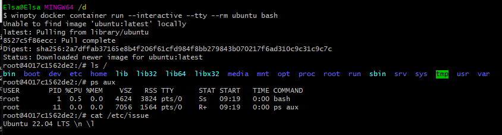
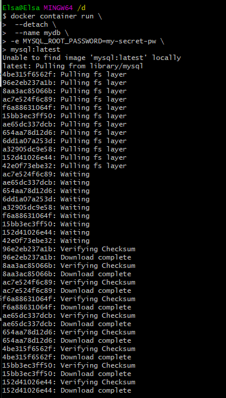
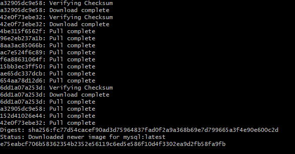
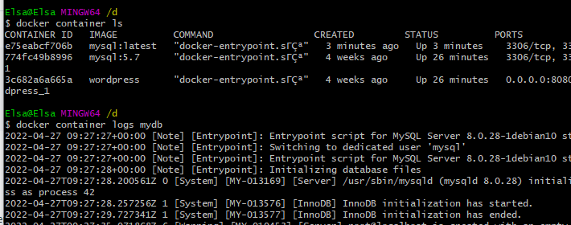
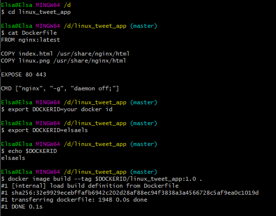
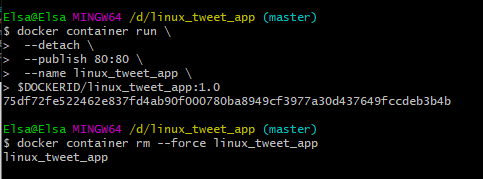

## _215611104 - Elsa Setiyawati_

# LATIHAN

## 1. Langkah pertama yaitu Clone the Lab’s GitHub Repo.

## 2. Run a single task in an Alpine Linux container

### a. “hostname” untuk mengecek hostname

### b. docker container run alpine hostname

### c. docker container ls

## 3. Run an interactive Ubuntu container

### Berikan perintah :

### a. winpty docker container run --interactive --tty --rm ubuntu bash

### b. ls /

### c. ps aux

### d. cat /etc/issue

## 4. Run a background MySQL container

### a. Berikan perintah ini pada CLI

docker container run \
 --detach \
 --name mydb \
 -e MYSQL_ROOT_PASSWORD=my-secret-pw \
 mysql:latest

### b. docker container ls

### c. docker container logs mydb

### d. docker container top mydb

### e. docker exec -it mydb

mysql --user=root --password=$MYSQL_ROOT_PASSWORD --version

## 5. Build a simple website image

### a. cd ~/linux_tweet_app

### b. cat Dockerfile

### c. export DOCKERID=your docker id

### d. echo $DOCKERID

### e. docker image build --tag $DOCKERID/linux_tweet_app:1.0 .

### f. masukkan perintah ini pada CLI

docker container run \
 --detach \
 --publish 80:80 \
 --name linux_tweet_app \
 $DOCKERID/linux_tweet_app:1.0

### g. docker container rm --force linux_tweet_app

