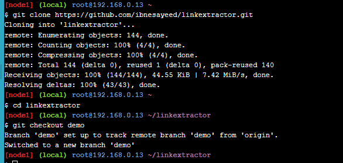
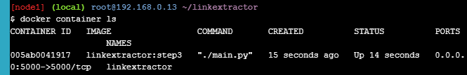

## _215611104 - Elsa Setiyawati_

# LATIHAN

# Application Containerization And Microservice Orchestration

## Stage Setup

### 1. git clone https://github.com/ibnesayeed/linkextractor.git

### 2. cd linkextractor

### 3. git checkout demo

## Step 0: Basic Link Extractor Script

### 1. git checkout step0

### 2. tree

### 3. cat linkextractor.py

### 4. ./linkextractor.py http://example.com/

### 5. ls -l linkextractor.py

### 6. python3 linkextractor.py

## Step 1: Containerized Link Extractor Script

### 1. git checkout step1

### 2. tree

### 3. cat Dockerfile

### 4. docker image build -t linkextractor:step1 .

### 5. docker image ls

### 6. docker container run -it --rm linkextractor:step1 http://example.com/

### 7. docker container run -it --rm linkextractor:step1 https://training.play-with-docker.com/

## Step 2: Link Extractor Module with Full URI and Anchor Text

### 1. git checkout step2

### 2. tree

### 3. cat linkextractor.py

### 4. docker image build -t linkextractor:step2 .

### 5. docker image ls

### 6. docker container run -it --rm linkextractor:step2 https://training.play-with-docker.com/

## Step 3: Link Extractor API Service

### 1. git checkout step3

### 2. tree

### 3. cat Dockerfile

### 4. cat main.py

### 5. docker image build -t linkextractor:step3 .

### 6. docker container run -d -p 5000:5000 --name=linkextractor linkextractor:step3

### 7. docker container ls

### 8. curl -i http://localhost:5000/api/http://example.com/

### 9. docker container logs linkextractor

### 10. docker container rm -f linkextractor

## Step 4: Link Extractor API and Web Front End Services

### 1. git checkout step4

### 2. tree

### 3. cat docker-compose.yml

### 4. cat www/index.php

### 5. docker-compose up -d --build

### 6. docker container ls

### 7. curl -i http://localhost:5000/api/http://example.com/

### 8. sed -i 's/Link Extractor/Super Link Extractor/g' www/index.php

### 9. git reset --hard

### 10. docker-compose down

## Step 5: Redis Service for Caching

### 1. git checkout step5

### 2. tree

### 3. cat www/Dockerfile

### 4. cat api/main.py

### 5. cat docker-compose.yml

### 6. docker-compose up -d --build

### 7. docker-compose exec redis redis-cli monitor

### 8. sed -i 's/Link Extractor/Super Link Extractor/g' www/index.php

### 9. git reset --hard

### 10. docker-compose down

## Step 6: Swap Python API Service with Ruby

### 1. git checkout step6

### 2. tree

### 3. cat api/linkextractor.rb

### 4. cat api/Dockerfile

### 5. cat docker-compose.yml

### 6. docker-compose up -d --build

### 7. curl -i http://localhost:4567/api/http://example.com/

### 8. docker-compose down

### 9. cat logs/extraction.log

