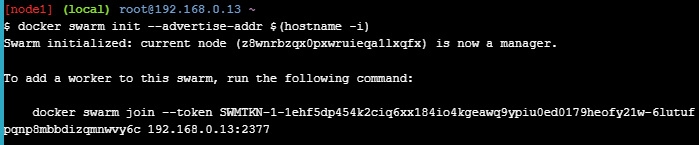
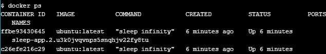

## _215611104 - Elsa Setiyawati_

# LATIHAN

# Orchestration Docker Orchestration Hands-on Lab

# Section 1: What is Orchestration

# Section 2: Configure Swarm Mode

## 1. docker run -dt ubuntu sleep infinity

## 2. docker ps

## Step 2.1 - Create a Manager node

### 1. docker swarm init --advertise-addr $(hostname -i)

### 2. docker info

## Step 2.2 - Join Worker nodes to the Swarm

### 1. docker node ls

# Section 3: Deploy applications across multiple hosts

## Step 3.1 - Deploy the application components as Docker services

### 1. docker service create --name sleep-app ubuntu sleep infinity

### 2. docker service ls

# Section 4: Scale the application

## 1. docker service update --replicas 7 sleep-app

## 2. docker service ps sleep-app

## 3. docker service update --replicas 4 sleep-app

## 4. docker service ps sleep-app

# Section 5: Drain a node and reschedule the containers

## 1. docker node ls

## 2. docker ps

## 3. docker node ls

## 4. docker node ls

## 5. docker ps

## 6. docker service ps sleep-app

# Cleaning Up

## 1. docker service rm sleep-app

## 2. docker ps

## 3. docker swarm leave –force

## 4. docker swarm leave --force

## 5. docker swarm leave –force

