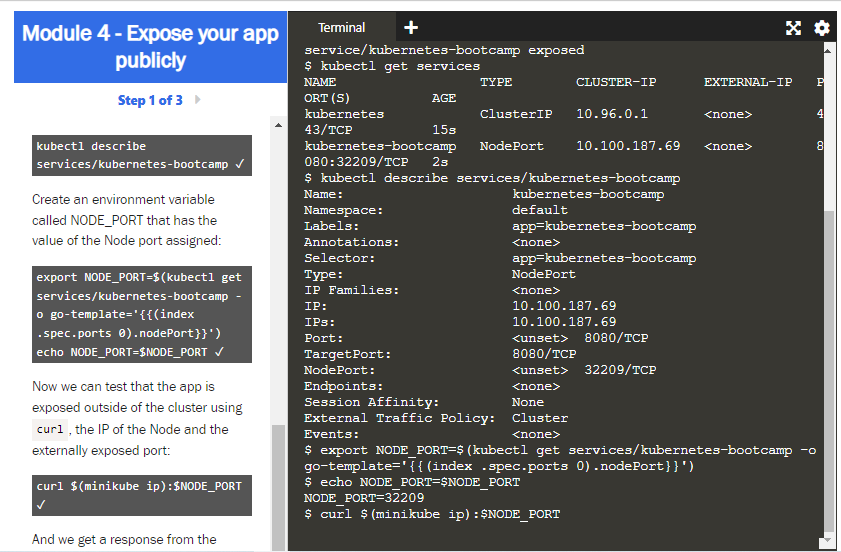

## _215611104 - Elsa Setiyawati_

# LATIHAN

# Learn Kubernetes Basics

## Panduan Dasar Kubernetes

### Tutorial ini menyediakan panduan dasar mekanisme orkestrasi klaster Kubernetes. Setiap modul memliki beberapa informasi mengenai latar belakang bagi konsep mendasar dan feature Kubernetes, termasuk mode interaktif yang dapat digunakan sebagai metode pembelajaran online. Mode tutorial interaktif ini memberikan kesempatan pengguna untuk melakukan manajemen klaster sederhana beserta aplikasi terkontainerisasi yang kamu miliki. Dengan menggunakan mode tutorial interaktif ini, pengguna diharapkan dapat memahami:

### • Deploy sebuah aplikasi yang sudah dikontainerisasi pada klaster

### • Melakukan scale deployment

### • Memperbarui aplikasi yang sudah dikontainerisasi dengan menggunakan versi aplikasi terbaru

### • Men-debug aplikasi yang sudah dikontainerisasi

### Tutorial ini menggunakan Katakoda untuk menjalankan terminal virtual diatas Minikube pada web browser kamu. Dengan demikian, kamu tidak perlu melakukan instalasi perangkat lunak apa pun, segala modul yang ada dijalankan secara langsung melalui web browser yang kamu miliki.

### Apa yang dapat dilakukan oleh Kubernetes untuk kamu?

### Seiring berkembangnya web servis modern, pengguna memiliki ekspektasi agar aplikasi selalu dapat diakses 24/7, selain itu developers juga memiliki harapan agar mereka dapat melakukan deployment aplikasi dengan versi terbaru yang mereka miliki berulang per hari. Mekanisme kontainerisasi mengepak perangkat lunak agar memenuhi kebutuhan yang ada, memudahkan serta mempercepat proses rilis dan pembaharuan aplikasi tanpa adanya downtime proses ini dapat dilakukan berulang per hari. Kubernetes membantu kamu menjaga aplikasi yang kamu buat untuk dapat dijalankan dimana pun dan kapan pun kamu menginginkannya, serta menjamin segala kebutuhan dan peralatan yang dibutuhkan oleh aplikasi kamu tersedia. Kubernetes merupakan platform open source yang sudah matang yang didesain berdasarkan pengalaman Google serta ide yang brilian dari komunitas yang ada.

### 

# Modul 1 - Interactive Tutorial - Creating a Cluster

## 1. minikube version

## 2. minikube start

## 3. kubectl version

## 4. kubectl cluster-info

## 5. kubectl get nodes

# Modul 2 - Deploy an App

## 1. kubectl version

## 2. kubectl get nodes

## 3. kubectl create deployment kubernetes-bootcamp --image=gcr.io/google-samples/kubernetes-bootcamp:v1

## 4. kubectl get deployments

# Modul 3 - Explore Your App

## 1. kubectl get pods

## 2. kubectl describe pods

## 3. kubectl logs $POD_NAME

## 4. kubectl exec $POD_NAME -- env

## 5. kubectl exec -ti $POD_NAME -- bash

## 6. cat server.js

## 7. curl localhost:8080

## 8. exit.

# Modul 4 - Using a Service to Expose Your App

## 1. kubectl get pods

## 2. kubectl get services

## 3. kubectl expose deployment/kubernetes-bootcamp --type="NodePort" --port 8080

## 4. kubectl get services

## 5. kubectl describe services/kubernetes-bootcamp

## 6. export NODE_PORT=$(kubectl get services/kubernetes-bootcamp -o go-template='{{(index .spec.ports 0).nodePort}}') echo NODE_PORT=$NODE_PORT

## 7. curl $(minikube ip):$NODE_PORT

## 8. kubectl describe deployment

## 9. kubectl get pods -l app=kubernetes-bootcamp

## 10. kubectl get services -l app=kubernetes-bootcamp

## 11. export POD_NAME=$(kubectl get pods -o go-template --template '{{range .items}}{{.metadata.name}}{{"\n"}}{{end}}') echo Name of the Pod: $POD_NAME

## 12. kubectl label pods $POD_NAME version=v1

## 13. kubectl describe pods $POD_NAME

## 14. kubectl get pods -l version=v1

## 15. kubectl delete service -l app=kubernetes-bootcamp

## 16. kubectl get services

## 17. curl $(minikube ip):$NODE_PORT

## 18. kubectl exec -ti $POD_NAME -- curl localhost:8080

# Modul 5 - Scaling Your App

## 1. kubectl get deployments

## 2. kubectl get rs

## 3. kubectl scale deployments/kubernetes-bootcamp --replicas=4

## 4. kubectl get deployments

## 5. kubectl get pods -o wide

## 6. kubectl describe deployments/kubernetes-bootcamp

## 7. kubectl describe services/kubernetes-bootcamp

## 8. export NODE_PORT=$(kubectl get services/kubernetes-bootcamp -o go-template='{{(index .spec.ports 0).nodePort}}') echo NODE_PORT=$NODE_PORT

## 9. curl $(minikube ip):$NODE_PORT

## 10. kubectl scale deployments/kubernetes-bootcamp --replicas=2

## 11. kubectl get deployments

## 12. kubectl get pods -o wide

# Modul 6 - Updating Your App

## 1. kubectl get deployments

## 2. kubectl get pods

## 3. kubectl describe pods

## 4. kubectl set image deployments/kubernetes-bootcamp kubernetes-bootcamp=jocatalin/kubernetes-bootcamp:v2

## 5. kubectl get pods

## 6. kubectl describe services/kubernetes-bootcamp

## 7. export NODE_PORT=$(kubectl get services/kubernetes-bootcamp -o go-template='{{(index .spec.ports 0).nodePort}}') echo NODE_PORT=$NODE_PORT

## 8. curl $(minikube ip):$NODE_PORT

## 9. kubectl rollout status deployments/kubernetes-bootcamp

## 10. kubectl describe pods

## 11. kubectl set image deployments/kubernetes-bootcamp kubernetes-bootcamp=gcr.io/google-samples/kubernetes-bootcamp:v10

## 12. kubectl get deployments

## 13. kubectl get pods

## 14. kubectl describe pods

## 15. kubectl rollout undo deployments/kubernetes-bootcamp

## 16. kubectl get pods

## 17. kubectl describe pods

